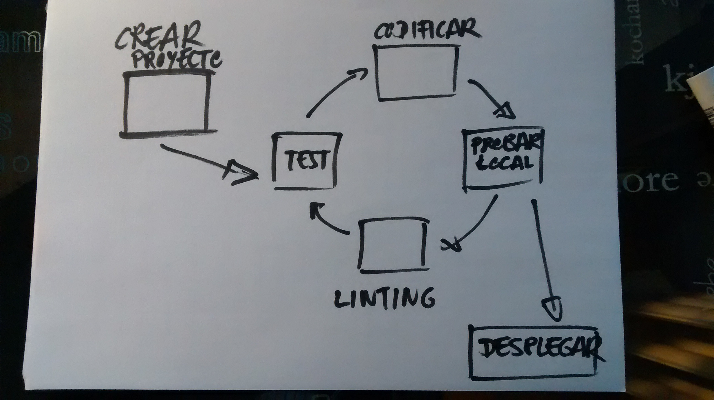

# Jornada 2: 

Use the Platform: 
Ciclo de vida de Angular 2 y herramientas nativas y gestión de dependencias.

## Objetivo de esta sesión.

El objetivo es instalar todo lo necesario para poder crear un proyecto Angular 2. Entender las diferentes piezas y herramientas que se necesitan para trabajar con Angular 2.

## Ciclo de vida

1. Crear el proyecto e instalar dependencias
2. Codificar
3. Probar en local
4. Linting
5. Testing
6. Desplegar

Cada una de estas partes del ciclo requieren de sus propias herramientas.

## Creación del proyecto

### Por dónde empezamos

Si vamos a crear un nuevo proyecto y empezamos desde cero tenemos varias opciones:

* _Utilizamos el CLI para crear un nuevo proyecto._ 

*Este proceso puede ser largo ... muy largo*

> npm install -g angular-cli

> ng --help

> ng new PROYECT_NAME

_Práctica instalar todos el angular-cli_

* _Nos bajamos el Starter Kit y empezamos a construir sobre eso._

_Práctica descargar el Starter Kit desde:_ https://github.com/AngularClass/angular2-webpack-starter

* _Buscamos unas "semilla" que tenga el proyecto lo mas parecido a lo que queremos._

_Práctica descargar la semilla más sencilla desde:_ https://github.com/AngularClass/angular2-seed

* _Buscamos un generador yeoman_ 

_Práctica descargar una semilla desde:_ http://yeoman.io/generators/ 

* _Construimos e instalamos nuestro proyecto desde cero._

Semilla de serenity: https://github.com/serenity-frontstack/angular2-basic

## Revisar los ejemplos de funcionamiento 